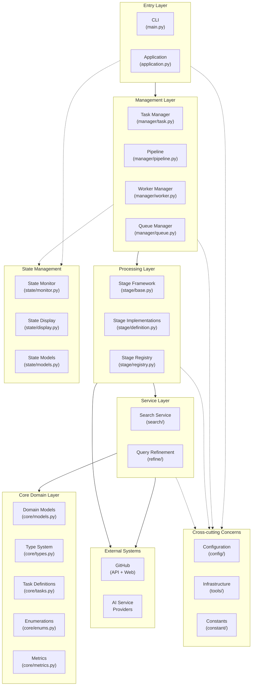
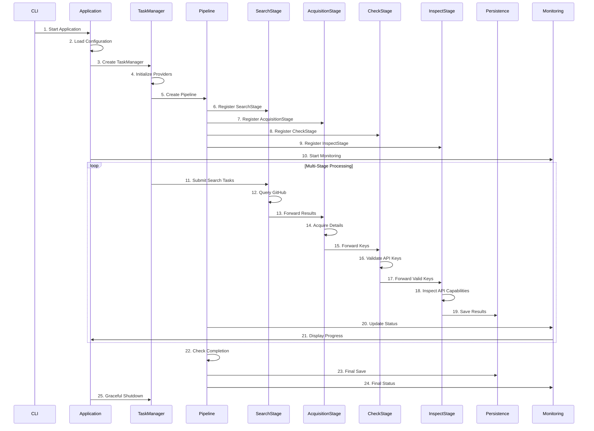

# Harvester - Universal Data Acquisition Framework

**📖 [中文文档](README.zh-CN.md) | English**

A universal, adaptive data acquisition framework designed for comprehensive information acquisition from multiple sources including GitHub, network mapping platforms (FOFA, Shodan), and arbitrary web endpoints. While the current implementation focuses on AI service provider key discovery as a practical example, the framework is architected for extensibility to support diverse data acquisition scenarios.

## Project Goals

The system aims to build a **universal data acquisition framework** primarily targeting:

- **GitHub**: Code repositories, issues, commits, and API endpoints
- **Network Mapping Platforms**: 
  - [FOFA](https://fofa.info) - Cyberspace mapping and asset discovery
  - [Shodan](https://www.shodan.io/) - Internet-connected device search engine
- **Arbitrary Web Endpoints**: Custom APIs, web services, and data sources
- **Extensible Architecture**: Plugin-based system for easy integration of new data sources

## Current Data Source Support

| Data Source | Status        | Description                             |
| ----------- | ------------- | --------------------------------------- |
| GitHub API  | ✅ Implemented | Full API integration with rate limiting |
| GitHub Web  | ✅ Implemented | Web scraping with intelligent parsing   |
| FOFA        | 🚧 Planned     | Cyberspace asset discovery integration  |
| Shodan      | 🚧 Planned     | IoT and network device enumeration      |
| Custom APIs | 🚧 Planned     | Generic REST/GraphQL API adapter        |

## Architecture

### Layered Architecture



### System Architecture Overview

```mermaid
graph TB
    %% User Interface Layer
    subgraph UserLayer["User Interface Layer"]
        User[User]
        CLI[Command Line Interface]
        ConfigMgmt[Configuration Management]
    end
    
    %% Application Orchestration Layer
    subgraph AppLayer["Application Orchestration Layer"]
        AppCore[Application Core]
        TaskOrchestrator[Task Orchestrator]
        ResourceCoordinator[Resource Coordinator]
    end
    
    %% Core Pipeline Engine with Advanced Features
    subgraph PipelineCore["Advanced Pipeline Engine"]
        %% Stage Management System
        subgraph StageSystem["Dynamic Stage Management"]
            StageRegistry[Stage Registry & Discovery]
            DependencyResolver[Dependency Resolver]
            DAGEngine[DAG Execution Engine]
        end
        
        %% Queue Management System
        subgraph QueueSystem["Intelligent Queue Management"]
            QueueManager[Multi-Queue Manager]
            LoadBalancer[Adaptive Load Balancer]
            TaskScheduler[Priority Task Scheduler]
        end
        
        %% Processing Stages
        subgraph ProcessingStages["Processing Stages"]
            SearchStage[Search Stage]
            AcquisitionStage[Acquisition Stage]
            CheckStage[Validation Stage]
            InspectStage[Inspect Stage]
        end
    end
    
    %% AI Provider Ecosystem
    subgraph ProviderEcosystem["AI Provider Ecosystem"]
        ProviderRegistry[Provider Registry]
        ProviderFactory[Provider Factory]
        OpenAIProvider[OpenAI Compatible]
        AnthropicProvider[Anthropic Claude]
        GeminiProvider[Google Gemini]
        CustomProviders[Custom Providers]
    end
    
    %% Advanced Processing Engines
    subgraph ProcessingEngines["Processing Engines"]
        SearchEngine[Intelligent Search Engine]
        
        %% Query Optimization Engine - Detailed Breakdown
        subgraph QueryOptimizer["Query Optimization Engine"]
            RegexParser[Regex Parser]
            SplittabilityAnalyzer[Splittability Analyzer]
            EnumerationOptimizer[Enumeration Optimizer]
            QueryGenerator[Query Generator]
            
            %% Internal Flow
            RegexParser --> SplittabilityAnalyzer
            SplittabilityAnalyzer --> EnumerationOptimizer
            EnumerationOptimizer --> QueryGenerator
        end
        
        ValidationEngine[API Key Validation Engine]
        RecoveryEngine[Task Recovery Engine]
    end
    
    %% State & Data Management
    subgraph StateManagement["State & Data Management"]
        StateMonitor[Real-time State Monitor]
        DataPersistence[Data Persistence Layer]
        QueuePersistence[Queue State Persistence]
        ResultAggregator[Result Aggregator]
        MonitoringSystem[Monitoring & Analytics]
    end
    
    %% Infrastructure Services
    subgraph Infrastructure["Infrastructure Services"]
        RateLimiting[Adaptive Rate Limiting]
        CredentialMgmt[Credential Management]
        AgentRotation[User Agent Rotation]
        LoggingSystem[Structured Logging]
        SecurityLayer[Security Layer]
    end
    
    %% External Systems
    subgraph External["External Systems"]
        GitHubAPI[GitHub API]
        GitHubWeb[GitHub Web Interface]
        AIServiceAPIs[AI Service APIs]
        FileSystem[Local File System]
    end
    
    %% User Interactions
    User --> CLI
    User --> ConfigMgmt
    CLI --> AppCore
    ConfigMgmt --> AppCore
    
    %% Application Flow
    AppCore --> TaskOrchestrator
    AppCore --> ResourceCoordinator
    TaskOrchestrator --> StageRegistry
    TaskOrchestrator --> QueueManager
    
    %% Stage Management Flow
    StageRegistry --> DependencyResolver
    DependencyResolver --> DAGEngine
    DAGEngine --> ProcessingStages
    
    %% Queue Management Flow
    QueueManager --> LoadBalancer
    QueueManager --> TaskScheduler
    LoadBalancer --> ProcessingStages
    TaskScheduler --> ProcessingStages
    
    %% Stage Dependencies (DAG)
    SearchStage --> AcquisitionStage
    AcquisitionStage --> CheckStage
    CheckStage --> InspectStage
    
    %% Processing Engine Integration
    SearchStage --> SearchEngine
    SearchStage --> QueryOptimizer
    CheckStage --> ValidationEngine
    ProcessingStages --> RecoveryEngine
    
    %% Provider Integration
    TaskOrchestrator --> ProviderRegistry
    ProviderRegistry --> ProviderFactory
    ProviderFactory --> OpenAIProvider
    ProviderFactory --> AnthropicProvider
    ProviderFactory --> GeminiProvider
    ProviderFactory --> CustomProviders
    
    %% State Management Integration
    DAGEngine --> StateMonitor
    QueueManager --> QueuePersistence
    ProcessingStages --> DataPersistence
    ProcessingStages --> ResultAggregator
    StateMonitor --> MonitoringSystem
    MonitoringSystem --> User
    
    %% Infrastructure Integration
    SearchEngine -.-> RateLimiting
    ResourceCoordinator -.-> CredentialMgmt
    ResourceCoordinator -.-> AgentRotation
    AppCore -.-> LoggingSystem
    ProcessingStages -.-> SecurityLayer
    
    %% External Connections
    SearchEngine --> GitHubAPI
    SearchEngine --> GitHubWeb
    ValidationEngine --> AIServiceAPIs
    DataPersistence --> FileSystem
    QueuePersistence --> FileSystem
    
    %% Styling
    classDef userClass fill:#e3f2fd,stroke:#1976d2,stroke-width:2px
    classDef appClass fill:#f3e5f5,stroke:#7b1fa2,stroke-width:2px
    classDef coreClass fill:#e8f5e8,stroke:#388e3c,stroke-width:3px
    classDef providerClass fill:#fff3e0,stroke:#f57c00,stroke-width:2px
    classDef engineClass fill:#fce4ec,stroke:#c2185b,stroke-width:2px
    classDef stateClass fill:#f1f8e9,stroke:#689f38,stroke-width:2px
    classDef infraClass fill:#f5f5f5,stroke:#616161,stroke-width:2px
    classDef externalClass fill:#ffebee,stroke:#d32f2f,stroke-width:2px
    
    class User,CLI,ConfigMgmt userClass
    class AppCore,TaskOrchestrator,ResourceCoordinator appClass
    class StageRegistry,DependencyResolver,DAGEngine,QueueManager,LoadBalancer,TaskScheduler,SearchStage,AcquisitionStage,CheckStage,InspectStage coreClass
    class ProviderRegistry,ProviderFactory,OpenAIProvider,AnthropicProvider,GeminiProvider,CustomProviders providerClass
    class SearchEngine,QueryOptimizer,ValidationEngine,RecoveryEngine engineClass
    class StateMonitor,DataPersistence,QueuePersistence,ResultAggregator,MonitoringSystem stateClass
    class RateLimiting,CredentialMgmt,AgentRotation,LoggingSystem,SecurityLayer infraClass
    class GitHubAPI,GitHubWeb,AIServiceAPIs,FileSystem externalClass
```



The project follows a layered architecture with the following core components:

### Multi-Stage Processing Flow



## Architecture Layers

### 1. **Presentation Layer**
   - **CLI Interface** (`main.py`): Command-line entry point with argument parsing
   - **Configuration System** (`config/`): YAML-based configuration management with validation

### 2. **Application Layer** 
   - **Application Orchestrator** (`application.py`): Main application lifecycle management
   - **Task Coordination** (`manager/task.py`): Provider and pipeline coordination
   - **Resource Management** (`manager/coordinator.py`): Global resource coordination

### 3. **Business Service Layer**
   - **Pipeline Engine** (`manager/pipeline.py`): Multi-stage processing orchestration
   - **Stage System** (`stage/`): Pluggable processing stages with dependency resolution
   - **Search Service** (`search/`): GitHub code search with multiple provider support
   - **Query Refinement** (`refine/`): Intelligent query optimization and generation

### 4. **Domain Layer**
   - **Core Models** (`core/models.py`): Business domain objects and data structures
   - **Type System** (`core/types.py`): Interface definitions and contracts
   - **Business Logic** (`core/enums.py`, `core/tasks.py`): Domain rules and task definitions
   - **Metrics & KPIs** (`core/metrics.py`): Performance measurement and analytics

### 5. **Infrastructure Layer**
   - **Data Persistence** (`manager/persistence.py`): Result storage and recovery
   - **Logging System** (`tools/logger.py`): Structured logging with API key redaction
   - **Rate Limiting** (`tools/ratelimit.py`): Adaptive rate control for external APIs
   - **Load Balancing** (`tools/balancer.py`): Resource distribution strategies
   - **Credential Management** (`manager/credential.py`): Secure credential rotation
   - **Agent Management** (`manager/agent.py`): User-agent rotation for web scraping

### 6. **Monitoring & State Layer**
   - **State Collection** (`state/collector.py`): System metrics gathering
   - **Real-time Monitoring** (`state/monitor.py`): Performance and health monitoring  
   - **Status Display** (`state/display.py`): User-friendly progress visualization
   - **State Models** (`state/models.py`): Monitoring data structures

## Processing Stages

The system implements a **4-stage pipeline** for comprehensive API key discovery:

1. **Search Stage**: Intelligent GitHub code search with advanced query optimization
2. **Acquisition Stage**: Detailed information acquisition from search results  
3. **Check Stage**: API key validation against actual service endpoints
4. **Inspect Stage**: API capability inspection for validated keys

## Advanced Query Optimization Engine

The system features a sophisticated **Query Optimization Engine** with mathematical foundations:

### Core Components

1. **Regex Parser**
   - Advanced regex pattern parsing with support for complex syntax
   - Handles escaped characters, character classes, and quantifiers
   - Converts patterns into analyzable segment structures

2. **Splittability Analyzer**
   - Mathematical analysis of pattern divisibility
   - Recursive depth limiting for safety
   - Value threshold analysis for optimization feasibility
   - Resource cost estimation for performance control

3. **Enumeration Optimizer**
   - Intelligent enumeration strategy selection
   - Multi-dimensional optimization (depth, breadth, value)
   - Combinatorial analysis for optimal segment selection
   - Topological sorting for dependency resolution

4. **Query Generator**
   - Generates optimized query variants from enumeration strategies
   - Supports configurable enumeration depth
   - Produces mathematically optimal query distributions
   - Maintains query semantic equivalence

### Optimization Algorithms

- **Mathematical Modeling**: Uses mathematical principles to analyze regex patterns
- **Enumeration Strategy**: Intelligent selection of optimal enumeration depth and combinations
- **Resource Management**: Prevents resource exhaustion through intelligent limiting
- **Performance Optimization**: Singleton pattern ensures optimal memory usage

## Supported Data Sources & Use Cases

### 🔍 Current Implementation (AI Service Discovery)
- **OpenAI and compatible interfaces**
- **Anthropic Claude**
- **Azure OpenAI**
- **Google Gemini**
- **AWS Bedrock**
- **GooeyAI**
- **Stability AI**
- **百度文心一言**
- **智谱AI**
- **Custom providers**

### 🌐 Planned Data Sources
- **[FOFA](https://fofa.info)**: Cyberspace asset discovery and network mapping
- **[Shodan](https://www.shodan.io/)**: Internet-connected device enumeration
- **Custom REST APIs**: Generic API integration framework
- **GraphQL Endpoints**: Flexible query-based data acquisition
- **Web Scraping**: JavaScript-rendered content and dynamic sites
- **Database Connectors**: Direct database query capabilities

### 📊 Potential Use Cases
- **Data Mining**: Large-scale information extraction and analysis

## Key Features

### 🌐 Universal Data Acquisition
- **Multi-Source Support**: GitHub, FOFA, Shodan, and custom endpoints
- **Adaptive Query Engine**: Intelligent optimization for different data sources
- **Protocol Agnostic**: REST, GraphQL, WebSocket, and web scraping support
- **Rate Limiting**: Per-source intelligent rate control and quota management

### 🏗️ Advanced Architecture
- **Dynamic Stage System**: Configurable processing pipelines with DAG execution
- **Plugin Architecture**: Extensible framework for custom data sources and processors
- **Dependency Resolution**: Automatic stage ordering and dependency management
- **Handler Registration**: Pluggable processors for flexible data transformation

### ⚡ High Performance
- **Asynchronous Processing**: Multi-threaded task execution with intelligent queuing
- **Adaptive Load Balancing**: Dynamic resource allocation based on workload
- **Query Optimization**: Mathematical modeling for optimal search strategies
- **Resource Monitoring**: Real-time performance tracking and bottleneck detection

### 🛡️ Enterprise Ready
- **Fault Tolerance**: Comprehensive error handling, retry mechanisms, and recovery
- **State Persistence**: Queue state recovery and graceful shutdown capabilities
- **Security**: Credential management, API key redaction, and secure storage
- **Monitoring**: Real-time analytics, alerting, and performance visualization

## Quick Start

1. **Installation**
   ```bash
   git clone https://github.com/wzdnzd/harvester.git
   cd harvester
   pip install -r requirements.txt
   ```

2. **Configuration**
   ```bash
   python main.py --create-config
   ```
   Edit the generated `config.yaml`:
   - Set your Github session token or API key
   - Configure provider search patterns
   - Adjust rate limits and thread counts

   ### Configuration Guide

   The system provides two configuration templates:

   1. **Basic Configuration** - Suitable for quick start:
      ```yaml
      global:
        workspace: "./data"  # Working directory
        github_credentials:
          sessions:
            - "your_github_session_here"  # GitHub session token
          strategy: "round_robin"  # Load balancing strategy

      pipeline:
        threads:
          search: 1    # Search threads (keep low)
          gather: 4   # Acquisition threads
          check: 2     # Validation threads
          inspect: 1    # API capability inspection threads

      tasks:
        - name: "openai"  # Provider name
          enabled: true   # Enable/disable provider
          provider_type: "openai_like"
          stages:
            search: true    # Enable search stage
            gather: true   # Enable acquisition stage
            check: true     # Enable validation stage
            inspect: true    # Enable API capability inspection
      ```

   2. **Full Configuration** - Includes all advanced options:
      - `display`: Display and monitoring settings
      - `global`: Global system configuration
      - `pipeline`: Pipeline stage configuration
      - `monitoring`: System monitoring parameters
      - `persistence`: Data persistence settings
      - `worker`: Worker pool configuration
      - `ratelimits`: Rate limiting settings
      - `tasks`: Provider task configurations
         ```yaml
         tasks:
           - name: "provider_name"
             api:
               base_url: "https://api.example.com"
               completion_path: "/v1/chat/completions"
               default_model: "model-name"
             patterns:
               key_pattern: "key matching pattern"
             conditions:
               - query: "search condition"
             extras:
               directory: "results directory"
         ```

   For complete configuration examples, refer to the template files in the `examples/` directory.

3. **Running**
   ```bash
   python main.py                  # Use default config
   python main.py -c custom.yaml   # Use custom config
   python main.py --validate       # Validate config
   python main.py --log-level DEBUG # Enable debug logging
   ```

## Project Structure

```
harvester/
├── config/             # Configuration management
│   ├── defaults.py    # Default configuration values
│   ├── factory.py     # Configuration factory classes
│   ├── loader.py      # Configuration loading utilities
│   ├── schemas.py     # Configuration schema definitions
│   └── validator.py   # Configuration validation
├── constant/          # Constants definition
│   ├── monitoring.py # Monitoring constants
│   ├── runtime.py    # Runtime constants
│   ├── search.py     # Search constants
│   └── system.py     # System constants
├── core/              # Core types and interfaces
│   ├── enums.py      # System enumerations
│   ├── metrics.py    # Performance metrics
│   ├── models.py     # Core data models
│   ├── tasks.py      # Task definitions
│   └── types.py      # Core type definitions
├── manager/           # Task and resource management
│   ├── agent.py      # Agent management
│   ├── coordinator.py # Resource coordination
│   ├── credential.py  # Credential management
│   ├── persistence.py # Result persistence management
│   ├── pipeline.py   # Pipeline management
│   ├── queue.py      # Queue management
│   ├── recovery.py   # Task recovery
│   ├── task.py       # Task management
│   └── worker.py     # Worker thread management
├── refine/            # Query optimization
│   ├── engine.py     # Optimization engine
│   ├── generator.py  # Query generation
│   ├── optimizer.py  # Query optimization
│   └── parser.py     # Query parsing
├── search/            # Search engines
│   ├── client.py     # Search client
│   └── provider/     # Provider implementations
├── stage/            # Pipeline stages
│   ├── base.py       # Base stage classes
│   ├── definition.py # Stage definitions
│   ├── factory.py    # Stage factory
│   └── registry.py   # Stage registry
├── state/            # State management
│   ├── collector.py  # State collection
│   ├── display.py    # State display
│   ├── models.py     # State data models
│   └── monitor.py    # State monitoring
├── tools/            # Utility functions
│   ├── balancer.py   # Load balancing
│   ├── logger.py     # Logging utilities
│   ├── ratelimit.py  # Rate limiting
│   └── utils.py      # General utilities
├── application.py    # Application class
├── config.yaml       # Configuration file
├── main.py          # Entry point
└── README.md        # Documentation
├── examples/         # Configuration examples
    ├── config-full.yaml    # Full configuration template
    └── config-simple.yaml  # Basic configuration template
```

## Advanced Features

1. **Real-time Monitoring**
   - Task status tracking
   - Performance metrics collection
   - Resource usage monitoring
   - Alert system

2. **Configuration Flexibility**
   - Multi-provider configuration
   - Custom search patterns
   - Adjustable performance parameters
   - Dynamic resource allocation

3. **Extensibility**
   - Plugin-style providers
   - Custom pipeline stages
   - Configurable monitoring system
   - Flexible recovery strategies

## Important Notes

1. **Limitations**
   - Respect Github API usage limits
   - Configure rate limits appropriately
   - Mind memory usage
   - Handle sensitive data carefully

2. **Best Practices**
   - Use appropriate thread counts
   - Backup results regularly
   - Monitor error rates
   - Handle alerts promptly

## TODO & Roadmap

### 🏗️ Core Architecture Improvements

#### Data Source Abstraction
- [ ] **Abstract Data Source Interface**: Create a unified interface for all data sources
  - [ ] Define `DataSourceProvider` base class with standard methods (`search`, `gather`, `validate`)
  - [ ] Implement adapter pattern for different API formats (REST, GraphQL, WebSocket)
  - [ ] Add configuration schema for data source registration
  - [ ] Support dynamic data source loading and hot-swapping

#### Stage System Enhancement
- [ ] **Flexible Stage Definition**: Move beyond the current 4-stage limitation
  - [ ] Create `StageDefinition` configuration format (YAML/JSON)
  - [ ] Implement dynamic stage loading from configuration files
  - [ ] Add stage composition and conditional execution
  - [ ] Support user-defined stage workflows and DAG customization

#### Handler/Processor Registration System
- [ ] **Pluggable Processing Architecture**: Replace fixed function calls with configurable handlers
  - [ ] Implement `HandlerRegistry` for stage-specific processors
  - [ ] Create `ProcessorInterface` with standardized input/output contracts
  - [ ] Add handler discovery mechanism (annotation-based or configuration-driven)
  - [ ] Support middleware chains for request/response processing

### 🌐 Data Source Integrations

#### Network Mapping Platforms
- [ ] **FOFA Integration**
  - [ ] Implement FOFA API client with authentication
  - [ ] Add FOFA-specific query optimization

- [ ] **Shodan Integration**
  - [ ] Support data querying and extraction from Shodan

#### Generic Web Sources
- [ ] **Universal Web Scraper**
  - [ ] Build configurable web scraping engine
  - [ ] Add support for JavaScript-rendered content (Selenium/Playwright)
  - [ ] Implement anti-bot detection bypass mechanisms
  - [ ] Create content extraction rule engine

### 🔧 Framework Enhancements

#### Configuration & Extensibility
- [ ] **Plugin System**
  - [ ] Design plugin architecture with lifecycle management
  - [ ] Create plugin marketplace and discovery mechanism
  - [ ] Add plugin sandboxing and security validation
  - [ ] Implement plugin dependency resolution

#### Performance & Scalability
- [ ] **Distributed Processing**
  - [ ] Add support for distributed task execution (Celery/RQ)
  - [ ] Implement horizontal scaling with load balancing
  - [ ] Create cluster management and node discovery
  - [ ] Add distributed state synchronization

#### Security
- [ ] **Enhanced Security Features**
  - [ ] Implement credential encryption and secure storage
  - [ ] Create rate limiting policies per data source

### 📊 Monitoring & Analytics

#### Advanced Monitoring
- [ ] **Real-time Analytics Dashboard**
  - [ ] Build web-based monitoring interface
  - [ ] Add real-time metrics visualization
  - [ ] Implement alerting and notification system
  - [ ] Create performance profiling and bottleneck analysis


### 🚀 Advanced Features

#### API & Integration
- [ ] **RESTful API Server**
  - [ ] Build comprehensive REST API for external integration
  - [ ] Implement webhook support for real-time notifications
  - [ ] Create SDK libraries for popular programming languages

## Contributing

Contributions are welcome! Before submitting a pull request, please ensure:

1. Tests are updated
2. Code follows style guidelines
3. Documentation is added where necessary
4. All tests pass

### Priority Areas for Contributors

- 🔥 **High Priority**: Data source abstraction and FOFA/Shodan integration
- 🔥 **High Priority**: Stage system flexibility and handler registration
- 🔥 **High Priority**: Plugin architecture and extensibility framework
- 🔥 **Medium Priority**: Performance optimization and distributed processing
- 🔥 **Medium Priority**: Web-based monitoring dashboard

## License

This project is licensed under the Creative Commons Attribution-NonCommercial 4.0 International License (CC BY-NC 4.0). See the [LICENSE](LICENSE) file for details.

## Disclaimer

**⚠️ IMPORTANT NOTICE**

This project is developed **solely for educational and technical research purposes**. Users should exercise caution and responsibility when using this software.

**Key Points:**
- This software is intended for learning, research, and educational use only
- Users must comply with all applicable laws and regulations in their jurisdiction
- Users are responsible for ensuring their usage complies with the terms of service of any third-party platforms or APIs
- **The project authors do not recommend, encourage, or endorse the use of this software for illegally obtaining others' API keys or credentials**
- The project authors assume **no responsibility** for any disputes, legal issues, or damages arising from the use of this software
- Commercial use is strictly prohibited without explicit written permission
- Users should respect the intellectual property rights and privacy of others

**By using this software, you acknowledge that you have read, understood, and agree to these terms. Use at your own risk.**

## Configuration Reference

### Persistence Configuration

The system supports flexible persistence options through the `persistence` section in your configuration:

```yaml
persistence:
  batch_size: 50              # Number of items to batch before writing
  save_interval: 30           # Seconds between periodic saves
  queue_interval: 60          # Seconds between queue state saves
  snapshot_interval: 300      # Seconds between snapshot builds
  auto_restore: true          # Automatically restore from previous session
  shutdown_timeout: 30        # Seconds to wait for graceful shutdown
  legacy_enabled: false       # Write legacy text files alongside NDJSON
```

#### Key Settings

- **`legacy_enabled`**: Controls whether to write legacy text files alongside NDJSON shards
  - `false` (default): Only write NDJSON shards (recommended for new deployments)
  - `true`: Write both NDJSON shards and legacy text files (for backward compatibility)

- **`shutdown_timeout`**: Unified timeout for all background thread joins during shutdown
  - Affects: persistence flush threads, queue save threads, worker manager threads
  - Default: 30 seconds
  - Minimum: 1 second

### Output Styles

The application supports two output styles:

```bash
# Classic style (concise, main.py-like output)
python main.py --style classic
python application.py --style classic

# Detailed style (verbose, application.py-like output)
python main.py --style detailed
python application.py --style detailed
```

## Development

### Code Quality

The project includes automated code quality checks:

```bash
# Install development dependencies
pip install -e ".[dev]"

# Run code quality checks
python scripts/check_code_quality.py

# Run tests
python scripts/run_tests.py

# Or manually:
ruff check .
ruff format --check .
mypy .
python -m unittest discover -s tests -p "test_*.py" -v
```

### Testing

The test suite covers:
- Persistence behavior with `legacy_enabled` toggle
- Shutdown timeout handling for all background threads
- Stage deduplication with bounded memory usage
- Renderer selection and style switching

## Contact

For questions or other inquiries during usage, please contact the project maintainers through GitHub Issues.