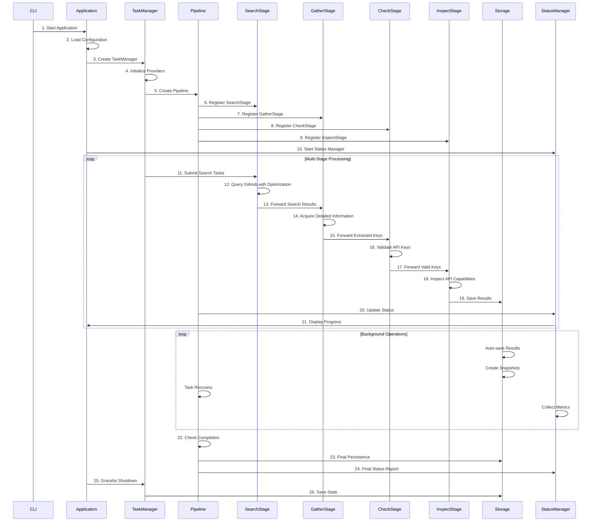

# Harvester - Universal Data Acquisition Framework

**📖 [中文文档](README.zh-CN.md) | English**

A universal, adaptive data acquisition framework designed for comprehensive information acquisition from multiple sources including GitHub, network mapping platforms (FOFA, Shodan), and arbitrary web endpoints. While the current implementation focuses on AI service provider key discovery as a practical example, the framework is architected for extensibility to support diverse data acquisition scenarios.

## Project Goals

The system aims to build a **universal data acquisition framework** primarily targeting:

- **GitHub**: Code repositories, issues, commits, and API endpoints
- **Network Mapping Platforms**: 
  - [FOFA](https://fofa.info) - Cyberspace mapping and asset discovery
  - [Shodan](https://www.shodan.io/) - Internet-connected device search engine
- **Arbitrary Web Endpoints**: Custom APIs, web services, and data sources
- **Extensible Architecture**: Plugin-based system for easy integration of new data sources

## Current Data Source Support

| Data Source | Status        | Description                             |
| ----------- | ------------- | --------------------------------------- |
| GitHub API  | ✅ Implemented | Full API integration with rate limiting |
| GitHub Web  | ✅ Implemented | Web scraping with intelligent parsing   |
| FOFA        | 🚧 Planned     | Cyberspace asset discovery integration  |
| Shodan      | 🚧 Planned     | IoT and network device enumeration      |
| Custom APIs | 🚧 Planned     | Generic REST/GraphQL API adapter        |

## Architecture

### Layered Architecture

```mermaid
graph TB
    %% Entry Layer
    subgraph Entry["Entry Layer"]
        CLI["CLI Interface<br/>(main.py)"]
        App["Application Core<br/>(main.py)"]
    end

    %% Management Layer
    subgraph Management["Management Layer"]
        TaskMgr["Task Manager<br/>(manager/task.py)"]
        Pipeline["Pipeline Manager<br/>(manager/pipeline.py)"]
        WorkerMgr["Worker Manager<br/>(manager/worker.py)"]
        QueueMgr["Queue Manager<br/>(manager/queue.py)"]
        Monitor["System Monitor<br/>(manager/monitor.py)"]
        Shutdown["Shutdown Coordinator<br/>(manager/shutdown.py)"]
    end

    %% Processing Layer
    subgraph Processing["Processing Layer"]
        StageBase["Stage Framework<br/>(stage/base.py)"]
        StageImpl["Stage Implementations<br/>(stage/definition.py)"]
        StageReg["Stage Registry<br/>(stage/registry.py)"]
        StageFactory["Stage Factory<br/>(stage/factory.py)"]
        StageResolver["Dependency Resolver<br/>(stage/resolver.py)"]
    end

    %% Service Layer
    subgraph Service["Service Layer"]
        SearchSvc["Search Service<br/>(search/client.py)"]
        SearchProviders["Search Providers<br/>(search/provider/)"]
        RefineSvc["Query Refinement<br/>(refine/)"]
        RefineEngine["Refine Engine<br/>(refine/engine.py)"]
        RefineOptimizer["Query Optimizer<br/>(refine/optimizer.py)"]
    end

    %% Core Domain Layer
    subgraph Core["Core Domain Layer"]
        Models["Domain Models<br/>(core/models.py)"]
        Types["Type System<br/>(core/types.py)"]
        Tasks["Task Definitions<br/>(core/tasks.py)"]
        Enums["Enumerations<br/>(core/enums.py)"]
        Metrics["Metrics<br/>(core/metrics.py)"]
        Auth["Authentication<br/>(core/auth.py)"]
    end

    %% Infrastructure Layer
    subgraph Infrastructure["Infrastructure Layer"]
        Config["Configuration<br/>(config/)"]
        Tools["Tools & Utilities<br/>(tools/)"]
        Constants["Constants<br/>(constant/)"]
        Storage["Storage & Persistence<br/>(storage/)"]
    end

    %% State Management Layer
    subgraph StateLayer["State Management Layer"]
        StateStatus["Status Manager<br/>(state/status.py)"]
        StateCollector["State Collector<br/>(state/collector.py)"]
        StateDisplay["Display Engine<br/>(state/display.py)"]
        StateBuilder["Status Builder<br/>(state/builder.py)"]
        StateModels["State Models<br/>(state/models.py)"]
    end

    %% External Systems
    subgraph External["External Systems"]
        GitHub["GitHub<br/>(API + Web)"]
        AIServices["AI Service<br/>Providers"]
        FileSystem["File System<br/>(Local Storage)"]
    end

    %% Dependencies (Top-down)
    Entry --> Management
    Management --> Processing
    Processing --> Service
    Service --> Core

    %% Infrastructure dependencies
    Entry -.-> Infrastructure
    Management -.-> Infrastructure
    Processing -.-> Infrastructure
    Service -.-> Infrastructure
    Core -.-> Infrastructure

    %% State management dependencies
    Entry -.-> StateLayer
    Management -.-> StateLayer

    %% External dependencies
    Service --> External
    Infrastructure --> External
```



### System Architecture Overview

```mermaid
graph TB
    %% User Interface Layer
    subgraph UserLayer["User Interface Layer"]
        User[User]
        CLI[Command Line Interface]
        ConfigMgmt[Configuration Management]
    end

    %% Application Management Layer
    subgraph AppLayer["Application Management Layer"]
        MainApp[Main Application]
        TaskManager[Task Manager]
        ResourceManager[Resource Manager]
        ShutdownManager[Shutdown Manager]
    end

    %% Core Pipeline Engine
    subgraph PipelineCore["Pipeline Engine"]
        %% Stage Management System
        subgraph StageSystem["Stage Management System"]
            StageRegistry[Stage Registry]
            DependencyResolver[Dependency Resolver]
            StageFactory[Stage Factory]
        end

        %% Queue Management System
        subgraph QueueSystem["Queue Management System"]
            QueueManager[Queue Manager]
            WorkerManager[Worker Manager]
            MonitoringSystem[System Monitor]
        end

        %% Processing Stages
        subgraph ProcessingStages["Processing Stages"]
            SearchStage[Search Stage]
            GatherStage[Gather Stage]
            CheckStage[Check Stage]
            InspectStage[Inspect Stage]
        end
    end

    %% Search Provider Ecosystem
    subgraph ProviderEcosystem["Search Provider Ecosystem"]
        ProviderRegistry[Provider Registry]
        BaseProvider[Base Provider]
        OpenAIProvider[OpenAI-like Provider]
        CustomProviders[Custom Providers]
    end

    %% Advanced Processing Engines
    subgraph ProcessingEngines["Processing Engines"]
        SearchClient[Search Client]

        %% Query Optimization Engine
        subgraph QueryOptimizer["Query Optimization Engine"]
            RefineEngine[Refine Engine]
            RegexParser[Regex Parser]
            SplittabilityAnalyzer[Splittability Analyzer]
            EnumerationOptimizer[Enumeration Optimizer]
            QueryGenerator[Query Generator]
            OptimizationStrategies[Optimization Strategies]

            %% Internal Flow
            RefineEngine --> RegexParser
            RegexParser --> SplittabilityAnalyzer
            SplittabilityAnalyzer --> EnumerationOptimizer
            EnumerationOptimizer --> OptimizationStrategies
            OptimizationStrategies --> QueryGenerator
        end

        ValidationEngine[API Key Validation]
        RecoveryEngine[Task Recovery]
    end

    %% State & Data Management
    subgraph StateManagement["State & Data Management"]
        StatusManager[Status Manager]
        StateCollector[State Collector]
        DisplayEngine[Display Engine]
        StatusBuilder[Status Builder]
        PersistenceLayer[Persistence Layer]
        SnapshotManager[Snapshot Manager]
        ResultManager[Result Manager]
    end

    %% Infrastructure Services
    subgraph Infrastructure["Infrastructure Services"]
        RateLimiting[Rate Limiting]
        CredentialMgmt[Credential Management]
        AgentRotation[User Agent Rotation]
        LoggingSystem[Logging System]
        RetryFramework[Retry Framework]
        ResourcePool[Resource Pool]
    end

    %% External Systems
    subgraph External["External Systems"]
        GitHubAPI[GitHub API]
        GitHubWeb[GitHub Web Interface]
        AIServiceAPIs[AI Service APIs]
        FileSystem[Local File System]
    end

    %% User Interactions
    User --> CLI
    User --> ConfigMgmt
    CLI --> MainApp
    ConfigMgmt --> MainApp

    %% Application Flow
    MainApp --> TaskManager
    MainApp --> ResourceManager
    MainApp --> ShutdownManager
    TaskManager --> StageRegistry
    TaskManager --> QueueManager

    %% Stage Management Flow
    StageRegistry --> DependencyResolver
    StageRegistry --> StageFactory
    DependencyResolver --> ProcessingStages
    StageFactory --> ProcessingStages

    %% Queue Management Flow
    QueueManager --> WorkerManager
    QueueManager --> MonitoringSystem
    WorkerManager --> ProcessingStages

    %% Stage Dependencies (Pipeline)
    SearchStage --> GatherStage
    GatherStage --> CheckStage
    CheckStage --> InspectStage

    %% Processing Engine Integration
    SearchStage --> SearchClient
    SearchStage --> QueryOptimizer
    CheckStage --> ValidationEngine
    ProcessingStages --> RecoveryEngine

    %% Provider Integration
    SearchClient --> ProviderRegistry
    ProviderRegistry --> BaseProvider
    BaseProvider --> OpenAIProvider
    BaseProvider --> CustomProviders

    %% State Management Integration
    ProcessingStages --> StatusManager
    QueueManager --> StateCollector
    StatusManager --> DisplayEngine
    StatusManager --> StatusBuilder
    ProcessingStages --> PersistenceLayer
    PersistenceLayer --> SnapshotManager
    PersistenceLayer --> ResultManager

    %% Infrastructure Integration
    SearchClient -.-> RateLimiting
    ResourceManager -.-> CredentialMgmt
    ResourceManager -.-> AgentRotation
    MainApp -.-> LoggingSystem
    ProcessingStages -.-> RetryFramework
    Infrastructure -.-> ResourcePool

    %% External Connections
    SearchClient --> GitHubAPI
    SearchClient --> GitHubWeb
    ValidationEngine --> AIServiceAPIs
    PersistenceLayer --> FileSystem

    %% Styling
    classDef userClass fill:#e3f2fd,stroke:#1976d2,stroke-width:2px
    classDef appClass fill:#f3e5f5,stroke:#7b1fa2,stroke-width:2px
    classDef coreClass fill:#e8f5e8,stroke:#388e3c,stroke-width:3px
    classDef providerClass fill:#fff3e0,stroke:#f57c00,stroke-width:2px
    classDef engineClass fill:#fce4ec,stroke:#c2185b,stroke-width:2px
    classDef stateClass fill:#f1f8e9,stroke:#689f38,stroke-width:2px
    classDef infraClass fill:#f5f5f5,stroke:#616161,stroke-width:2px
    classDef externalClass fill:#ffebee,stroke:#d32f2f,stroke-width:2px

    class User,CLI,ConfigMgmt userClass
    class MainApp,TaskManager,ResourceManager,ShutdownManager appClass
    class StageRegistry,DependencyResolver,StageFactory,QueueManager,WorkerManager,MonitoringSystem,SearchStage,GatherStage,CheckStage,InspectStage coreClass
    class ProviderRegistry,BaseProvider,OpenAIProvider,CustomProviders providerClass
    class SearchClient,QueryOptimizer,ValidationEngine,RecoveryEngine engineClass
    class StatusManager,StateCollector,DisplayEngine,StatusBuilder,PersistenceLayer,SnapshotManager,ResultManager stateClass
    class RateLimiting,CredentialMgmt,AgentRotation,LoggingSystem,RetryFramework,ResourcePool infraClass
    class GitHubAPI,GitHubWeb,AIServiceAPIs,FileSystem externalClass
```



The project follows a layered architecture with the following core components:

### Multi-Stage Processing Flow



## Architecture Layers

### 1. **Presentation Layer**
   - **CLI Interface** (`main.py`): Command-line entry point with argument parsing and application lifecycle
   - **Configuration System** (`config/`): YAML-based configuration management with validation and schemas

### 2. **Application Layer**
   - **Application Core** (`main.py`): Main application lifecycle and orchestration
   - **Task Management** (`manager/task.py`): Provider coordination and task distribution
   - **Resource Coordination** (`tools/coordinator.py`): Global resource management and coordination
   - **Shutdown Management** (`manager/shutdown.py`): Graceful shutdown coordination
   - **Worker Management** (`manager/worker.py`): Worker thread management and scaling
   - **Queue Management** (`manager/queue.py`): Multi-queue coordination and management

### 3. **Business Service Layer**
   - **Pipeline Engine** (`manager/pipeline.py`): Multi-stage processing orchestration with DAG execution
   - **Stage System** (`stage/`): Pluggable processing stages with dependency resolution and factory pattern
   - **Search Service** (`search/`): GitHub code search with provider abstraction and optimization
   - **Query Refinement** (`refine/`): Intelligent query optimization with strategy pattern and mathematical foundations

### 4. **Domain Layer**
   - **Core Models** (`core/models.py`): Business domain objects and data structures
   - **Type System** (`core/types.py`): Interface definitions and contracts
   - **Task Definitions** (`core/tasks.py`): Domain-specific task types and workflows
   - **Business Enums** (`core/enums.py`): Domain enumerations and constants
   - **Metrics & Analytics** (`core/metrics.py`): Performance measurement and KPI tracking
   - **Authentication** (`core/auth.py`): Authentication and authorization logic
   - **Custom Exceptions** (`core/exceptions.py`): Domain-specific exception handling
   - **Custom Exceptions** (`core/exceptions.py`): Domain-specific exception handling

### 5. **Infrastructure Layer**
   - **Storage & Persistence** (`storage/`): Result storage, recovery, and snapshot management
     - **Atomic Operations** (`storage/atomic.py`): Atomic file operations with fsync
     - **Result Management** (`storage/persistence.py`): Multi-format result persistence
     - **Task Recovery** (`storage/recovery.py`): Task recovery mechanisms
     - **Shard Management** (`storage/shard.py`): NDJSON shard management with rotation
     - **Snapshot Management** (`storage/snapshot.py`): Backup and restore functionality
   - **Tools & Utilities** (`tools/`): Infrastructure tools and utilities
     - **Logging System** (`tools/logger.py`): Structured logging with API key redaction
     - **Rate Limiting** (`tools/ratelimit.py`): Adaptive rate control with token bucket algorithm
     - **Load Balancing** (`tools/balancer.py`): Resource distribution strategies
     - **Credential Management** (`tools/credential.py`): Secure credential rotation and management
     - **Agent Management** (`tools/agent.py`): User-agent rotation for web scraping
     - **Retry Framework** (`tools/retry.py`): Unified retry mechanisms with backoff strategies
     - **Resource Pooling** (`tools/resources.py`): Resource pool management and optimization

### 6. **State Management Layer**
   - **Status Management** (`state/status.py`): Centralized status management and coordination
   - **State Collection** (`state/collector.py`): System metrics gathering and aggregation
   - **Display Engine** (`state/display.py`): User-friendly progress visualization and formatting
   - **Status Builder** (`state/builder.py`): Status data construction and transformation
   - **State Models** (`state/models.py`): Monitoring data structures and metrics
   - **State Configuration** (`state/config.py`): Display configuration management
   - **Field Mapping** (`state/mapper.py`): Data field mapping and transformation
   - **Status Rendering** (`state/renderer.py`): Status output rendering and formatting

## Processing Stages

The system implements a **4-stage pipeline** for comprehensive data acquisition and validation:

1. **Search Stage** (`stage/definition.py:SearchStage`):
   - Intelligent GitHub code search with advanced query optimization
   - Multi-provider search support (API + Web)
   - Query refinement using mathematical optimization algorithms
   - Rate-limited search execution with adaptive throttling

2. **Gather Stage** (`stage/definition.py:GatherStage`):
   - Detailed information acquisition from search results
   - Content extraction and parsing
   - Pattern matching for key identification
   - Structured data collection and normalization

3. **Check Stage** (`stage/definition.py:CheckStage`):
   - API key validation against actual service endpoints
   - Authentication verification and capability testing
   - Service availability and response validation
   - Error handling and retry mechanisms

4. **Inspect Stage** (`stage/definition.py:InspectStage`):
   - API capability inspection for validated keys
   - Model enumeration and feature detection
   - Service limits and quota analysis
   - Comprehensive capability profiling

## Advanced Query Optimization Engine

The system features a sophisticated **Query Optimization Engine** with mathematical foundations:

### Core Components

1. **Regex Parser**
   - Advanced regex pattern parsing with support for complex syntax
   - Handles escaped characters, character classes, and quantifiers
   - Converts patterns into analyzable segment structures

2. **Splittability Analyzer**
   - Mathematical analysis of pattern divisibility
   - Recursive depth limiting for safety
   - Value threshold analysis for optimization feasibility
   - Resource cost estimation for performance control

3. **Enumeration Optimizer**
   - Intelligent enumeration strategy selection
   - Multi-dimensional optimization (depth, breadth, value)
   - Combinatorial analysis for optimal segment selection
   - Topological sorting for dependency resolution

4. **Query Generator**
   - Generates optimized query variants from enumeration strategies
   - Supports configurable enumeration depth
   - Produces mathematically optimal query distributions
   - Maintains query semantic equivalence

### Optimization Algorithms

- **Mathematical Modeling**: Uses mathematical principles to analyze regex patterns
- **Enumeration Strategy**: Intelligent selection of optimal enumeration depth and combinations
- **Resource Management**: Prevents resource exhaustion through intelligent limiting
- **Performance Optimization**: Singleton pattern ensures optimal memory usage

## Supported Data Sources & Use Cases

### 🔍 Current Implementation (AI Service Discovery)
- **OpenAI and compatible interfaces**
- **Anthropic Claude**
- **Azure OpenAI**
- **Google Gemini**
- **AWS Bedrock**
- **GooeyAI**
- **Stability AI**
- **百度文心一言**
- **智谱AI**
- **Custom providers**

### 🌐 Planned Data Sources
- **[FOFA](https://fofa.info)**: Cyberspace asset discovery and network mapping
- **[Shodan](https://www.shodan.io/)**: Internet-connected device enumeration
- **Custom REST APIs**: Generic API integration framework
- **GraphQL Endpoints**: Flexible query-based data acquisition
- **Web Scraping**: JavaScript-rendered content and dynamic sites
- **Database Connectors**: Direct database query capabilities

### 📊 Potential Use Cases
- **Data Mining**: Large-scale information extraction and analysis

## Key Features

### 🌐 Universal Data Acquisition
- **Multi-Source Support**: GitHub, FOFA, Shodan, and custom endpoints
- **Adaptive Query Engine**: Intelligent optimization for different data sources
- **Protocol Agnostic**: REST, GraphQL, WebSocket, and web scraping support
- **Rate Limiting**: Per-source intelligent rate control and quota management

### 🏗️ Advanced Architecture
- **Dynamic Stage System**: Configurable processing pipelines with DAG execution
- **Plugin Architecture**: Extensible framework for custom data sources and processors
- **Dependency Resolution**: Automatic stage ordering and dependency management
- **Handler Registration**: Pluggable processors for flexible data transformation

### ⚡ High Performance
- **Asynchronous Processing**: Multi-threaded task execution with intelligent queuing
- **Adaptive Load Balancing**: Dynamic resource allocation based on workload
- **Query Optimization**: Mathematical modeling for optimal search strategies
- **Resource Monitoring**: Real-time performance tracking and bottleneck detection

### 🛡️ Enterprise Ready
- **Fault Tolerance**: Comprehensive error handling, retry mechanisms, and recovery
- **State Persistence**: Queue state recovery and graceful shutdown capabilities
- **Security**: Credential management, API key redaction, and secure storage
- **Monitoring**: Real-time analytics, alerting, and performance visualization

## Quick Start

1. **Installation**
   ```bash
   git clone https://github.com/wzdnzd/harvester.git
   cd harvester
   pip install -r requirements.txt
   ```

2. **Configuration**
   ```bash
   python main.py --create-config
   ```
   Edit the generated `config.yaml`:
   - Set your Github session token or API key
   - Configure provider search patterns
   - Adjust rate limits and thread counts

   ### Configuration Guide

   The system provides two configuration templates:

   1. **Basic Configuration** - Suitable for quick start:
      ```yaml
      global:
        workspace: "./data"  # Working directory
        github_credentials:
          sessions:
            - "your_github_session_here"  # GitHub session token
          strategy: "round_robin"  # Load balancing strategy

      pipeline:
        threads:
          search: 1    # Search threads (keep low)
          gather: 4   # Acquisition threads
          check: 2     # Validation threads
          inspect: 1    # API capability inspection threads

      tasks:
        - name: "openai"  # Provider name
          enabled: true   # Enable/disable provider
          provider_type: "openai_like"
          stages:
            search: true    # Enable search stage
            gather: true   # Enable acquisition stage
            check: true     # Enable validation stage
            inspect: true    # Enable API capability inspection
      ```

   2. **Full Configuration** - Includes all advanced options:
      - `display`: Display and monitoring settings
      - `global`: Global system configuration
      - `pipeline`: Pipeline stage configuration
      - `monitoring`: System monitoring parameters
      - `persistence`: Data persistence settings
      - `worker`: Worker pool configuration
      - `ratelimits`: Rate limiting settings
      - `tasks`: Provider task configurations
         ```yaml
         tasks:
           - name: "provider_name"
             api:
               base_url: "https://api.example.com"
               completion_path: "/v1/chat/completions"
               default_model: "model-name"
             patterns:
               key_pattern: "key matching pattern"
             conditions:
               - query: "search condition"
             extras:
               directory: "results directory"
         ```

   For complete configuration examples, refer to the template files in the `examples/` directory.

3. **Running**
   ```bash
   python main.py                  # Use default config
   python main.py -c custom.yaml   # Use custom config
   python main.py --validate       # Validate config
   python main.py --log-level DEBUG # Enable debug logging
   ```

## Project Structure

```
harvester/
├── config/           # Configuration management
│   ├── accessor.py   # Configuration access utilities
│   ├── defaults.py   # Default configuration values
│   ├── loader.py     # Configuration loading
│   ├── schemas.py    # Configuration schemas
│   ├── validator.py  # Configuration validation
│   └── __init__.py   # Package initialization
├── constant/         # System constants
│   ├── monitoring.py # Monitoring constants
│   ├── runtime.py    # Runtime constants
│   ├── search.py     # Search constants
│   ├── system.py     # System constants
│   └── __init__.py   # Package initialization
├── core/             # Core domain models
│   ├── auth.py       # Authentication
│   ├── enums.py      # System enumerations
│   ├── exceptions.py # Custom exceptions
│   ├── metrics.py    # Performance metrics
│   ├── models.py     # Core data models
│   ├── tasks.py      # Task definitions
│   ├── types.py      # Core type definitions
│   └── __init__.py   # Package initialization
├── examples/         # Configuration examples
│   ├── config-full.yaml    # Complete configuration template
│   └── config-simple.yaml  # Basic configuration template
├── manager/          # Task and resource management
│   ├── base.py       # Base management classes
│   ├── monitor.py    # System monitoring
│   ├── pipeline.py   # Pipeline management
│   ├── queue.py      # Queue management
│   ├── shutdown.py   # Shutdown coordination
│   ├── task.py       # Task management
│   ├── watcher.py    # Resource watching
│   ├── worker.py     # Worker thread management
│   └── __init__.py   # Package initialization
├── refine/           # Query optimization
│   ├── config.py     # Refine configuration
│   ├── engine.py     # Optimization engine
│   ├── generator.py  # Query generation
│   ├── optimizer.py  # Query optimization
│   ├── parser.py     # Query parsing
│   ├── segment.py    # Pattern segmentation
│   ├── splittability.py # Splittability analysis
│   ├── strategies.py # Optimization strategies
│   ├── types.py      # Refine type definitions
│   └── __init__.py   # Package initialization
├── search/           # Search engines
│   ├── client.py     # Search client
│   ├── provider/     # Provider implementations
│   │   ├── anthropic.py    # Anthropic provider
│   │   ├── azure.py        # Azure OpenAI provider
│   │   ├── base.py         # Base provider class
│   │   ├── bedrock.py      # AWS Bedrock provider
│   │   ├── doubao.py       # ByteDance Doubao provider
│   │   ├── gemini.py       # Google Gemini provider
│   │   ├── gooeyai.py      # GooeyAI provider
│   │   ├── openai.py       # OpenAI provider
│   │   ├── openai_like.py  # OpenAI-compatible provider
│   │   ├── qianfan.py      # Baidu Qianfan provider
│   │   ├── registry.py     # Provider registry
│   │   ├── stabilityai.py  # Stability AI provider
│   │   ├── vertex.py       # Google Vertex AI provider
│   │   └── __init__.py     # Package initialization
│   └── __init__.py   # Package initialization
├── stage/            # Pipeline stages
│   ├── base.py       # Base stage classes
│   ├── definition.py # Stage implementations
│   ├── factory.py    # Stage factory
│   ├── registry.py   # Stage registry
│   ├── resolver.py   # Dependency resolver
│   └── __init__.py   # Package initialization
├── state/            # State management
│   ├── builder.py    # Status builder
│   ├── collector.py  # State collection
│   ├── config.py     # State configuration
│   ├── display.py    # Display engine
│   ├── mapper.py     # Field mapping
│   ├── models.py     # State data models
│   ├── renderer.py   # Status rendering
│   ├── status.py     # Status manager
│   └── __init__.py   # Package initialization
├── storage/          # Storage and persistence
│   ├── atomic.py     # Atomic file operations
│   ├── persistence.py # Result persistence
│   ├── recovery.py   # Task recovery
│   ├── shard.py      # NDJSON shard management
│   ├── snapshot.py   # Snapshot management
│   └── __init__.py   # Package initialization
├── tools/            # Tools and utilities
│   ├── agent.py      # User agent management
│   ├── balancer.py   # Load balancing
│   ├── coordinator.py # Resource coordination
│   ├── credential.py # Credential management
│   ├── logger.py     # Logging system
│   ├── ratelimit.py  # Rate limiting
│   ├── resources.py  # Resource pooling
│   ├── retry.py      # Retry framework
│   ├── utils.py      # General utilities
│   └── __init__.py   # Package initialization
├── .gitignore        # Git ignore rules
├── LICENSE           # License file
├── main.py           # Entry point and application core
├── README.md         # English documentation
├── README.zh-CN.md   # Chinese documentation
├── requirements.txt  # Python dependencies
└── __init__.py       # Root package initialization
```

## Advanced Features

1. **Real-time Monitoring**
   - Task status tracking
   - Performance metrics collection
   - Resource usage monitoring
   - Alert system

2. **Configuration Flexibility**
   - Multi-provider configuration
   - Custom search patterns
   - Adjustable performance parameters
   - Dynamic resource allocation

3. **Extensibility**
   - Plugin-style providers
   - Custom pipeline stages
   - Configurable monitoring system
   - Flexible recovery strategies

## Important Notes

1. **Limitations**
   - Respect Github API usage limits
   - Configure rate limits appropriately
   - Mind memory usage
   - Handle sensitive data carefully

2. **Best Practices**
   - Use appropriate thread counts
   - Backup results regularly
   - Monitor error rates
   - Handle alerts promptly

## TODO & Roadmap

### 🏗️ Core Architecture Improvements

#### Data Source Abstraction
- [ ] **Abstract Data Source Interface**: Create a unified interface for all data sources
  - [ ] Define `DataSourceProvider` base class with standard methods (`search`, `gather`, `validate`)
  - [ ] Implement adapter pattern for different API formats (REST, GraphQL, WebSocket)
  - [ ] Add configuration schema for data source registration
  - [ ] Support dynamic data source loading and hot-swapping

#### Stage System Enhancement
- [ ] **Flexible Stage Definition**: Move beyond the current 4-stage limitation
  - [ ] Create `StageDefinition` configuration format (YAML/JSON)
  - [ ] Implement dynamic stage loading from configuration files
  - [ ] Add stage composition and conditional execution
  - [ ] Support user-defined stage workflows and DAG customization

#### Handler/Processor Registration System
- [ ] **Pluggable Processing Architecture**: Replace fixed function calls with configurable handlers
  - [ ] Implement `HandlerRegistry` for stage-specific processors
  - [ ] Create `ProcessorInterface` with standardized input/output contracts
  - [ ] Add handler discovery mechanism (annotation-based or configuration-driven)
  - [ ] Support middleware chains for request/response processing

### 🌐 Data Source Integrations

#### Network Mapping Platforms
- [ ] **FOFA Integration**
  - [ ] Implement FOFA API client with authentication
  - [ ] Add FOFA-specific query optimization

- [ ] **Shodan Integration**
  - [ ] Support data querying and extraction from Shodan

#### Generic Web Sources
- [ ] **Universal Web Scraper**
  - [ ] Build configurable web scraping engine
  - [ ] Add support for JavaScript-rendered content (Selenium/Playwright)
  - [ ] Implement anti-bot detection bypass mechanisms
  - [ ] Create content extraction rule engine

### 🔧 Framework Enhancements

#### Configuration & Extensibility
- [ ] **Plugin System**
  - [ ] Design plugin architecture with lifecycle management
  - [ ] Create plugin marketplace and discovery mechanism
  - [ ] Add plugin sandboxing and security validation
  - [ ] Implement plugin dependency resolution

#### Performance & Scalability
- [ ] **Distributed Processing**
  - [ ] Add support for distributed task execution (Celery/RQ)
  - [ ] Implement horizontal scaling with load balancing
  - [ ] Create cluster management and node discovery
  - [ ] Add distributed state synchronization

#### Security
- [ ] **Enhanced Security Features**
  - [ ] Implement credential encryption and secure storage
  - [ ] Create rate limiting policies per data source

### 📊 Monitoring & Analytics

#### Advanced Monitoring
- [ ] **Real-time Analytics Dashboard**
  - [ ] Build web-based monitoring interface
  - [ ] Add real-time metrics visualization
  - [ ] Implement alerting and notification system
  - [ ] Create performance profiling and bottleneck analysis


### 🚀 Advanced Features

#### API & Integration
- [ ] **RESTful API Server**
  - [ ] Build comprehensive REST API for external integration
  - [ ] Implement webhook support for real-time notifications
  - [ ] Create SDK libraries for popular programming languages

## Contributing

Contributions are welcome! Before submitting a pull request, please ensure:

1. Tests are updated
2. Code follows style guidelines
3. Documentation is added where necessary
4. All tests pass

### Priority Areas for Contributors

- 🔥 **High Priority**: Data source abstraction and FOFA/Shodan integration
- 🔥 **High Priority**: Stage system flexibility and handler registration
- 🔥 **High Priority**: Plugin architecture and extensibility framework
- 🔥 **Medium Priority**: Performance optimization and distributed processing
- 🔥 **Medium Priority**: Web-based monitoring dashboard

## License

This project is licensed under the Creative Commons Attribution-NonCommercial 4.0 International License (CC BY-NC 4.0). See the [LICENSE](LICENSE) file for details.

## Disclaimer

**⚠️ IMPORTANT NOTICE**

This project is developed **solely for educational and technical research purposes**. Users should exercise caution and responsibility when using this software.

**Key Points:**
- This software is intended for learning, research, and educational use only
- Users must comply with all applicable laws and regulations in their jurisdiction
- Users are responsible for ensuring their usage complies with the terms of service of any third-party platforms or APIs
- **The project authors do not recommend, encourage, or endorse the use of this software for illegally obtaining others' API keys or credentials**
- The project authors assume **no responsibility** for any disputes, legal issues, or damages arising from the use of this software
- Commercial use is strictly prohibited without explicit written permission
- Users should respect the intellectual property rights and privacy of others

**By using this software, you acknowledge that you have read, understood, and agree to these terms. Use at your own risk.**

## Configuration Reference

### Persistence Configuration

The system supports flexible persistence options through the `persistence` section in your configuration:

```yaml
persistence:
  batch_size: 50              # Number of items to batch before writing
  save_interval: 30           # Seconds between periodic saves
  queue_interval: 60          # Seconds between queue state saves
  snapshot_interval: 300      # Seconds between snapshot builds
  auto_restore: true          # Automatically restore from previous session
  shutdown_timeout: 30        # Seconds to wait for graceful shutdown
  format: txt                 # Output format, support txt or ndjson
```

#### Key Settings

- **`format`**: Controls whether to write text files alongside NDJSON shards
  - `false` (default): Only write NDJSON shards (recommended for new deployments)
  - `true`: Write both NDJSON shards and legacy text files (for backward compatibility)

- **`shutdown_timeout`**: Unified timeout for all background thread joins during shutdown
  - Affects: persistence flush threads, queue save threads, worker manager threads
  - Default: 30 seconds
  - Minimum: 1 second

### Output Styles

The application supports two output styles:

```bash
# Classic style (concise output)
python main.py --style classic

# Detailed style (verbose output)
python main.py --style detailed
```

## Contact

For questions or other inquiries during usage, please contact the project maintainers through GitHub Issues.

## Notes

Visit [ai-collector](https://github.com/wzdnzd/ai-collector) for more useful tools.