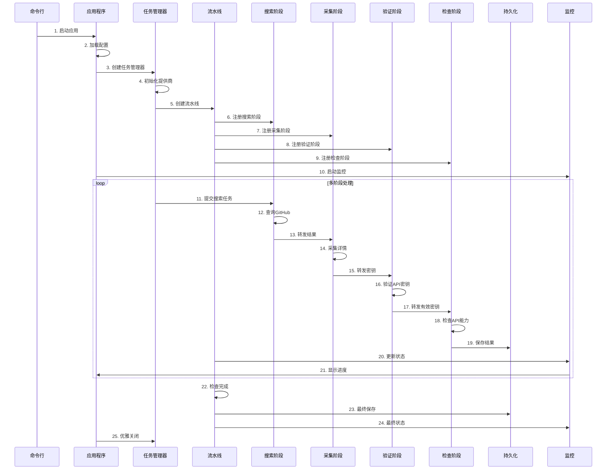

# Harvester - 通用数据采集框架

**中文文档 |📖 [English](README.md) | 🔗 [更多工具](https://github.com/wzdnzd/ai-collector)**

一个通用的、自适应的数据采集框架，专为从多种数据源进行全面信息采集而设计，支持GitHub、网络测绘平台（FOFA、Shodan）以及任意网络端点。虽然当前实现专注于AI服务提供商密钥发现作为实际应用示例，但框架在架构上具备可扩展性，可支持多样化的数据采集场景。

---

⭐⭐⭐ **如果这个项目对您有帮助，请给个小星星！** 您的支持是我们持续改进和添加新功能的动力。

---

## 目录

- [主要功能](#主要功能)
- [快速开始](#快速开始)
- [项目架构](#项目架构)
- [目录结构](#目录结构)
- [故障排除](#故障排除)
- [贡献指南](#贡献指南)

## 项目目标

系统旨在构建一个**通用数据采集框架**，主要面向：

- **GitHub**: 代码仓库、问题、提交记录和API端点
- **网络测绘平台**: 
  - [FOFA](https://fofa.info) - 网络空间测绘和资产发现
  - [Shodan](https://www.shodan.io/) - 互联网连接设备搜索引擎
- **任意网络端点**: 自定义API、网络服务和数据源
- **可扩展架构**: 基于插件的系统，便于集成新数据源

## 当前数据源支持

| 数据源     | 状态     | 描述                       |
| ---------- | -------- | -------------------------- |
| GitHub API | ✅ 已实现 | 完整API集成，支持速率限制  |
| GitHub Web | ✅ 已实现 | 网页抓取，智能解析         |
| FOFA       | 🚧 计划中 | 网络空间资产发现集成       |
| Shodan     | 🚧 计划中 | IoT和网络设备枚举          |
| 自定义API  | 🚧 计划中 | 通用REST/GraphQL API适配器 |

## 项目架构

### 分层架构

```mermaid
graph TB
    %% 入口层
    subgraph Entry["入口层"]
        CLI["命令行接口<br/>(main.py)"]
        App["应用程序核心<br/>(main.py)"]
    end

    %% 管理层
    subgraph Management["管理层"]
        TaskMgr["任务管理器<br/>(manager/task.py)"]
        Pipeline["流水线管理器<br/>(manager/pipeline.py)"]
        WorkerMgr["工作线程管理器<br/>(manager/worker.py)"]
        QueueMgr["队列管理器<br/>(manager/queue.py)"]
        StatusMgr["状态管理器<br/>(manager/status.py)"]
        Shutdown["关闭协调器<br/>(manager/shutdown.py)"]
    end

    %% 处理层
    subgraph Processing["处理层"]
        StageBase["阶段框架<br/>(stage/base.py)"]
        StageImpl["阶段实现<br/>(stage/definition.py)"]
        StageReg["阶段注册<br/>(stage/registry.py)"]
        StageFactory["阶段工厂<br/>(stage/factory.py)"]
        StageResolver["依赖解析器<br/>(stage/resolver.py)"]
    end

    %% 服务层
    subgraph Service["服务层"]
        SearchSvc["搜索服务<br/>(search/client.py)"]
        SearchProviders["搜索提供商<br/>(search/provider/)"]
        RefineSvc["查询优化<br/>(refine/)"]
        RefineEngine["优化引擎<br/>(refine/engine.py)"]
        RefineOptimizer["查询优化器<br/>(refine/optimizer.py)"]
    end

    %% 核心领域层
    subgraph Core["核心领域层"]
        Models["领域模型与任务<br/>(core/models.py)"]
        Types["类型系统<br/>(core/types.py)"]
        Enums["枚举<br/>(core/enums.py)"]
        Metrics["指标<br/>(core/metrics.py)"]
        Auth["身份认证<br/>(core/auth.py)"]
    end

    %% 基础设施层
    subgraph Infrastructure["基础设施层"]
        Config["配置<br/>(config/)"]
        Tools["工具与实用程序<br/>(tools/)"]
        Constants["常量<br/>(constant/)"]
        Storage["存储与持久化<br/>(storage/)"]
    end

    %% 状态管理层
    subgraph StateLayer["状态管理层"]
        StateCollector["状态收集器<br/>(state/collector.py)"]
        StateDisplay["显示引擎<br/>(state/display.py)"]
        StateBuilder["状态构建器<br/>(state/builder.py)"]
        StateModels["状态模型<br/>(state/models.py)"]
        StateMonitor["状态监控器<br/>(state/monitor.py)"]
        StateEnums["状态枚举<br/>(state/enums.py)"]
        StateTypes["状态类型<br/>(state/types.py)"]
    end

    %% 外部系统
    subgraph External["外部系统"]
        GitHub["GitHub<br/>(API + Web)"]
        AIServices["AI服务<br/>提供商"]
        FileSystem["文件系统<br/>(本地存储)"]
    end

    %% 依赖关系（自上而下）
    Entry --> Management
    Management --> Processing
    Processing --> Service
    Service --> Core

    %% 基础设施依赖
    Entry -.-> Infrastructure
    Management -.-> Infrastructure
    Processing -.-> Infrastructure
    Service -.-> Infrastructure
    Core -.-> Infrastructure

    %% 状态管理依赖
    Entry -.-> StateLayer
    Management -.-> StateLayer

    %% 外部依赖
    Service --> External
    Infrastructure --> External
```



### 系统架构总览

```mermaid
graph TB
    %% 用户界面层
    subgraph UserLayer["用户界面层"]
        User[用户]
        CLI[命令行接口]
        ConfigMgmt[配置管理]
    end
    
    %% 应用管理层
    subgraph AppLayer["应用管理层"]
        MainApp[主应用程序]
        TaskManager[任务管理器]
        StatusManager[状态管理器]
        ResourceManager[资源管理器]
        ShutdownManager[关闭管理器]
    end
    
    %% 高级流水线引擎核心
    subgraph PipelineCore["高级流水线引擎"]
        %% 阶段管理系统
        subgraph StageSystem["动态阶段管理"]
            StageRegistry[阶段注册与发现]
            DependencyResolver[依赖解析器]
            DAGEngine[DAG执行引擎]
        end
        
        %% 队列管理系统
        subgraph QueueSystem["智能队列管理"]
            QueueManager[多队列管理器]
            LoadBalancer[自适应负载均衡器]
            TaskScheduler[优先级任务调度器]
        end
        
        %% 处理阶段
        subgraph ProcessingStages["处理阶段"]
            SearchStage[搜索阶段]
            AcquisitionStage[采集阶段]
            CheckStage[验证阶段]
            InspectStage[检查阶段]
        end
    end
    
    %% AI提供商生态系统
    subgraph ProviderEcosystem["AI提供商生态系统"]
        ProviderRegistry[提供商注册中心]
        ProviderFactory[提供商工厂]
        OpenAIProvider[OpenAI兼容]
        AnthropicProvider[Anthropic Claude]
        GeminiProvider[Google Gemini]
        CustomProviders[自定义提供商]
    end
    
    %% 高级处理引擎
    subgraph ProcessingEngines["处理引擎"]
        SearchEngine[智能搜索引擎]
        
        %% 查询优化引擎 - 详细分解
        subgraph QueryOptimizer["查询优化引擎"]
            RegexParser[正则解析器]
            SplittabilityAnalyzer[可分割性分析器]
            EnumerationOptimizer[枚举优化器]
            QueryGenerator[查询生成器]
            
            %% 内部流程
            RegexParser --> SplittabilityAnalyzer
            SplittabilityAnalyzer --> EnumerationOptimizer
            EnumerationOptimizer --> QueryGenerator
        end
        
        ValidationEngine[API密钥验证引擎]
        RecoveryEngine[任务恢复引擎]
    end
    
    %% 状态与数据管理
    subgraph StateManagement["状态与数据管理"]
        StateCollector[状态收集器]
        StateMonitor[实时状态监控器]
        DisplayEngine[显示引擎]
        StatusBuilder[状态构建器]
        DataPersistence[数据持久化层]
        QueuePersistence[队列状态持久化]
        ResultAggregator[结果聚合器]
        MonitoringSystem[监控分析系统]
    end
    
    %% 基础设施服务
    subgraph Infrastructure["基础设施服务"]
        RateLimiting[自适应速率限制]
        CredentialMgmt[凭证管理]
        AgentRotation[用户代理轮换]
        LoggingSystem[结构化日志]
        SecurityLayer[安全层]
    end
    
    %% 外部系统
    subgraph External["外部系统"]
        GitHubAPI[GitHub API]
        GitHubWeb[GitHub Web界面]
        AIServiceAPIs[AI服务API]
        FileSystem[本地文件系统]
    end
    
    %% 用户交互
    User --> CLI
    User --> ConfigMgmt
    CLI --> MainApp
    ConfigMgmt --> MainApp
    
    %% 应用流程
    MainApp --> TaskManager
    MainApp --> StatusManager
    MainApp --> ResourceManager
    MainApp --> ShutdownManager
    TaskManager --> StageRegistry
    TaskManager --> QueueManager
    
    %% 阶段管理流程
    StageRegistry --> DependencyResolver
    DependencyResolver --> DAGEngine
    DAGEngine --> ProcessingStages
    
    %% 队列管理流程
    QueueManager --> LoadBalancer
    QueueManager --> TaskScheduler
    LoadBalancer --> ProcessingStages
    TaskScheduler --> ProcessingStages
    
    %% 阶段依赖关系（DAG）
    SearchStage --> AcquisitionStage
    AcquisitionStage --> CheckStage
    CheckStage --> InspectStage
    
    %% 处理引擎集成
    SearchStage --> SearchEngine
    SearchStage --> QueryOptimizer
    CheckStage --> ValidationEngine
    ProcessingStages --> RecoveryEngine
    
    %% 提供商集成
    TaskManager --> ProviderRegistry
    ProviderRegistry --> BaseProvider
    BaseProvider --> OpenAIProvider
    BaseProvider --> AnthropicProvider
    BaseProvider --> CustomProviders
    
    %% 状态管理集成
    DAGEngine --> StateCollector
    QueueManager --> QueuePersistence
    ProcessingStages --> DataPersistence
    ProcessingStages --> ResultAggregator
    StateCollector --> DisplayEngine
    StateMonitor --> MonitoringSystem
    MonitoringSystem --> User
    
    %% 基础设施集成
    SearchClient -.-> RateLimiting
    ResourceManager -.-> CredentialMgmt
    ResourceManager -.-> AgentRotation
    MainApp -.-> LoggingSystem
    ProcessingStages -.-> RetryFramework
    
    %% 外部连接
    SearchEngine --> GitHubAPI
    SearchEngine --> GitHubWeb
    ValidationEngine --> AIServiceAPIs
    DataPersistence --> FileSystem
    QueuePersistence --> FileSystem
    
    %% 样式
    classDef userClass fill:#e3f2fd,stroke:#1976d2,stroke-width:2px
    classDef appClass fill:#f3e5f5,stroke:#7b1fa2,stroke-width:2px
    classDef coreClass fill:#e8f5e8,stroke:#388e3c,stroke-width:3px
    classDef providerClass fill:#fff3e0,stroke:#f57c00,stroke-width:2px
    classDef engineClass fill:#fce4ec,stroke:#c2185b,stroke-width:2px
    classDef stateClass fill:#f1f8e9,stroke:#689f38,stroke-width:2px
    classDef infraClass fill:#f5f5f5,stroke:#616161,stroke-width:2px
    classDef externalClass fill:#ffebee,stroke:#d32f2f,stroke-width:2px
    
    class User,CLI,ConfigMgmt userClass
    class MainApp,TaskManager,StatusManager,ResourceManager,ShutdownManager appClass
    class StageRegistry,DependencyResolver,DAGEngine,QueueManager,LoadBalancer,TaskScheduler,SearchStage,AcquisitionStage,CheckStage,InspectStage coreClass
    class ProviderRegistry,ProviderFactory,OpenAIProvider,AnthropicProvider,GeminiProvider,CustomProviders providerClass
    class SearchEngine,QueryOptimizer,ValidationEngine,RecoveryEngine engineClass
    class StateCollector,StateMonitor,DisplayEngine,StatusBuilder,DataPersistence,QueuePersistence,ResultAggregator,MonitoringSystem stateClass
    class RateLimiting,CredentialMgmt,AgentRotation,LoggingSystem,SecurityLayer infraClass
    class GitHubAPI,GitHubWeb,AIServiceAPIs,FileSystem externalClass
```



该项目采用分层架构设计，主要包含以下核心组件：

### 多阶段处理流程



## 架构层次

### 1. **表示层**
   - **命令行接口** (`main.py`): 命令行入口点，参数解析
   - **配置系统** (`config/`): 基于YAML的配置管理和验证

### 2. **应用层**
   - **应用核心** (`main.py`): 主应用生命周期管理和入口点
   - **任务管理** (`manager/task.py`): 提供商协调和任务分发
   - **资源协调** (`tools/coordinator.py`): 全局资源管理和协调
   - **关闭管理** (`manager/shutdown.py`): 优雅关闭协调
   - **状态管理** (`manager/status.py`): 应用状态管理和协调
   - **工作线程管理** (`manager/worker.py`): 工作线程管理和扩展
   - **队列管理** (`manager/queue.py`): 多队列协调和管理

### 3. **业务服务层**
   - **流水线引擎** (`manager/pipeline.py`): 多阶段处理编排
   - **阶段系统** (`stage/`): 可插拔处理阶段，支持依赖解析
   - **搜索服务** (`search/`): GitHub代码搜索，支持多提供商
   - **查询优化** (`refine/`): 智能查询优化和生成

### 4. **领域层**
   - **核心模型与任务** (`core/models.py`): 业务领域对象、数据结构和任务定义
   - **类型系统** (`core/types.py`): 接口定义和契约
   - **业务枚举** (`core/enums.py`): 领域枚举和常量
   - **指标分析** (`core/metrics.py`): 性能测量和KPI跟踪
   - **身份认证** (`core/auth.py`): 认证和授权逻辑
   - **自定义异常** (`core/exceptions.py`): 领域特定异常处理

### 5. **基础设施层**
   - **存储与持久化** (`storage/`): 结果存储、恢复和快照管理
     - **原子操作** (`storage/atomic.py`): 带fsync的原子文件操作
     - **结果管理** (`storage/persistence.py`): 多格式结果持久化
     - **任务恢复** (`storage/recovery.py`): 任务恢复机制
     - **分片管理** (`storage/shard.py`): 带轮换的NDJSON分片管理
     - **快照管理** (`storage/snapshot.py`): 备份和恢复功能
   - **工具与实用程序** (`tools/`): 基础设施工具和实用程序
     - **日志系统** (`tools/logger.py`): 结构化日志，支持API密钥脱敏
     - **速率限制** (`tools/ratelimit.py`): 带令牌桶算法的自适应速率控制
     - **负载均衡** (`tools/balancer.py`): 资源分配策略
     - **凭证管理** (`tools/credential.py`): 安全凭证轮换和管理
     - **代理管理** (`tools/agent.py`): 网页抓取的用户代理轮换
     - **模式匹配** (`tools/patterns.py`): 模式匹配工具和辅助函数
     - **重试框架** (`tools/retry.py`): 带退避策略的统一重试机制
     - **资源池** (`tools/resources.py`): 资源池管理和优化

### 6. **状态管理层**
   - **状态收集** (`state/collector.py`): 系统指标收集和聚合
   - **显示引擎** (`state/display.py`): 用户友好的进度可视化和格式化
   - **状态构建器** (`state/builder.py`): 状态数据构建和转换
   - **状态模型** (`state/models.py`): 监控数据结构和指标
   - **状态监控** (`state/monitor.py`): 实时状态监控和跟踪
   - **状态枚举** (`state/enums.py`): 状态相关枚举和常量
   - **状态类型** (`state/types.py`): 状态类型定义和接口


## 处理阶段

系统实现了**4阶段流水线**，用于全面的数据采集和验证：

1. **搜索阶段** (`stage/definition.py:SearchStage`):
   - 智能GitHub代码搜索，支持高级查询优化
   - 多提供商搜索支持（API + Web）
   - 使用数学优化算法进行查询优化
   - 自适应限流的搜索执行

2. **采集阶段** (`stage/definition.py:GatherStage`):
   - 从搜索结果中采集详细信息
   - 内容提取和解析
   - 模式匹配进行关键信息识别
   - 结构化数据收集和标准化

3. **验证阶段** (`stage/definition.py:CheckStage`):
   - 针对实际服务端点验证API密钥
   - 身份验证验证和能力测试
   - 服务可用性和响应验证
   - 错误处理和重试机制

4. **检查阶段** (`stage/definition.py:InspectStage`):
   - 为有效密钥检查API能力
   - 模型枚举和功能检测
   - 服务限制和配额分析
   - 全面的能力分析

## 高级查询优化引擎

系统配备了基于数学原理的**查询优化引擎**：

### 核心组件

1. **正则解析器**
   - 高级正则表达式解析，支持复杂语法
   - 处理转义字符、字符类和量词
   - 将模式转换为可分析的段结构

2. **可分割性分析器**
   - 基于数学原理的模式可分性分析
   - 递归深度限制确保安全性
   - 价值阈值分析评估优化可行性
   - 资源成本估算控制性能

3. **枚举优化器**
   - 智能枚举策略选择
   - 多维度优化（深度、广度、价值）
   - 组合分析选择最优段组合
   - 拓扑排序解决依赖关系

4. **查询生成器**
   - 从枚举策略生成优化查询变体
   - 支持可配置的枚举深度
   - 产生数学最优的查询分布
   - 保持查询语义等价性

### 优化算法

- **数学建模**: 使用数学原理分析正则表达式模式
- **枚举策略**: 智能选择最优枚举深度和组合
- **资源管理**: 通过智能限制防止资源耗尽
- **性能优化**: 单例模式确保最优内存使用

## 支持的数据源与应用场景

### 🔍 当前实现（AI服务发现）
- **OpenAI 及兼容接口**
- **Anthropic Claude**
- **Azure OpenAI**
- **Google Gemini**
- **AWS Bedrock**
- **GooeyAI**
- **Stability AI**
- **百度文心一言**
- **智谱AI**
- **自定义提供商**

### 🌐 计划支持的数据源
- **[FOFA](https://fofa.info)**: 网络空间资产发现和网络测绘
- **[Shodan](https://www.shodan.io/)**: 互联网连接设备枚举
- **自定义REST API**: 通用API集成框架
- **GraphQL端点**: 基于查询的灵活数据采集
- **网页抓取**: JavaScript渲染内容和动态网站
- **数据库连接器**: 直接数据库查询能力

### 📊 潜在应用场景
- **数据挖掘**: 信息提取和分析

## 主要功能

### 🌐 通用数据采集
- **多源支持**: GitHub、FOFA、Shodan和自定义端点
- **自适应查询引擎**: 针对不同数据源的智能优化
- **协议无关**: 支持REST、GraphQL、WebSocket和网页抓取
- **速率限制**: 每个数据源的智能速率控制和配额管理

### 🏗️ 高级架构
- **动态阶段系统**: 可配置的处理流水线，支持DAG执行
- **插件架构**: 可扩展框架，支持自定义数据源和处理器
- **依赖解析**: 自动阶段排序和依赖管理
- **处理器注册**: 可插拔处理器，实现灵活的数据转换

### ⚡ 高性能
- **异步处理**: 多线程任务执行，智能队列管理
- **自适应负载均衡**: 基于工作负载的动态资源分配
- **查询优化**: 基于数学建模的最优搜索策略
- **资源监控**: 实时性能跟踪和瓶颈检测

### 🛡️ 企业级
- **容错机制**: 全面的错误处理、重试机制和恢复能力
- **状态持久化**: 队列状态恢复和优雅关闭能力
- **安全性**: 凭证管理、API密钥脱敏和安全存储
- **监控**: 实时分析、警报和性能可视化

## 系统要求

### **依赖项**
- **Python**: 3.10+
- **第三方库**: `PyYAML`
- **可选**: `uvloop` (Linux/macOS 性能提升)
- **开发**: `pytest`, `black`, `mypy` (贡献者使用)

## 快速开始

> 📚 如需完整文档、教程和高级用法指南，请访问 [DeepWiki 文档](https://deepwiki.com/wzdnzd/harvester)

1. **安装**
   ```bash
   git clone https://github.com/wzdnzd/harvester.git
   cd harvester
   pip install -r requirements.txt
   ```

2. **配置**

  > 选择以下方法之一创建配置文件

   **方法一：生成默认配置**
   ```bash
   python main.py --create-config
   ```

   **方法二：从示例复制**
   ```bash
   # 基础配置
   cp examples/config-simple.yaml config.yaml

   # 包含所有选项的完整配置
   cp examples/config-full.yaml config.yaml
   ```

   编辑配置文件：
   - 设置Github会话令牌或API密钥
   - 配置提供商搜索模式
   - 调整速率限制和线程数

   ### 配置文件说明

   系统提供了两种配置模板：

   1. **基础配置** - 适合快速开始使用：
      ```yaml
      # 全局应用设置
      global:
        workspace: "./data"  # 工作目录
        github_credentials:
          sessions:
            - "your_github_session_here"  # GitHub会话令牌
          strategy: "round_robin"  # 负载均衡策略

      # 流水线阶段配置
      pipeline:
        threads:
          search: 1    # 搜索线程数（建议保持较低）
          gather: 4   # 采集线程数
          check: 2     # 验证线程数
          inspect: 1    # API能力检查线程数

      # 系统监控设置
      monitoring:
        update_interval: 2.0    # 监控更新间隔
        error_threshold: 0.1    # 错误率阈值

      # 数据持久化配置
      persistence:
        auto_restore: true      # 启动时自动恢复状态
        shutdown_timeout: 30    # 关闭超时时间（秒）

      # 全局速率限制配置
      ratelimits:
        github_web:
          base_rate: 0.5       # 基础速率（每秒请求数）
          burst_limit: 2       # 最大突发大小
          adaptive: true       # 启用自适应速率限制

      # 提供商任务配置
      tasks:
        - name: "openai"         # 提供商名称
          enabled: true          # 是否启用
          provider_type: "openai"
          use_api: false         # 使用GitHub API进行搜索
          
          # 流水线阶段设置
          stages:
            search: true         # 启用搜索阶段
            gather: true         # 启用采集阶段
            check: true          # 启用验证阶段
            inspect: true        # 启用API能力检查
          
          # 模式匹配配置
          patterns:
            key_pattern: "sk(?:-proj)?-[a-zA-Z0-9]{20}T3BlbkFJ[a-zA-Z0-9]{20}"
          
          # 搜索条件
          conditions:
            - query: '"T3BlbkFJ"'
      ```

   2. **完整配置** - 包含所有高级选项：
      - `display`: 显示和监控配置
      - `global`: 全局系统设置
      - `pipeline`: 流水线阶段配置
      - `monitoring`: 系统监控参数
      - `persistence`: 数据持久化设置
      - `worker`: 工作线程池配置
      - `ratelimits`: 速率限制设置
      - `tasks`: 提供商任务配置
         ```yaml
         tasks:
           - name: "provider_name"
             api:
               base_url: "https://api.example.com"
               completion_path: "/v1/chat/completions"
               default_model: "model-name"
             patterns:
               key_pattern: "密钥匹配模式"
             conditions:
               - query: "搜索条件"
             extras:
               directory: "结果目录"
         ```

   ### 高级任务配置

   > 📋 **完整配置示例请参考：**
   > - [`examples/config-full.yaml`](examples/config-full.yaml) - 包含所有可用选项的完整配置
   > - [`examples/config-simple.yaml`](examples/config-simple.yaml) - 快速开始的基础配置

   `tasks` 部分是配置的核心，定义了要搜索哪些提供商以及如何处理它们。请参考上面基础配置示例中的完整tasks配置。

   #### 主要配置选项

   - **`name`**: 任务的唯一标识符
   - **`provider_type`**: 决定验证方法（`openai`、`openai_like`、`anthropic`、`gemini` 等）
   - **`api`**: 用于密钥验证的API端点配置
   - **`patterns.key_pattern`**: 识别有效API密钥的正则表达式模式
   - **`conditions`**: 用于查找潜在密钥的搜索查询
   - **`stages`**: 启用/禁用特定的处理阶段
   - **`extras.directory`**: 结果的自定义输出目录

3. **运行**
   ```bash
   python main.py                  # 使用默认配置
   python main.py -c custom.yaml   # 使用自定义配置
   python main.py --validate       # 验证配置
   python main.py --log-level DEBUG # 启用调试日志
   ```

## 目录结构

```
harvester/
├── config/           # 配置管理
│   ├── accessor.py   # 配置访问工具
│   ├── defaults.py   # 默认配置值
│   ├── loader.py     # 配置加载
│   ├── schemas.py    # 配置模式
│   ├── validator.py  # 配置验证
│   └── __init__.py   # 包初始化
├── constant/         # 系统常量
│   ├── monitoring.py # 监控常量
│   ├── runtime.py    # 运行时常量
│   ├── search.py     # 搜索常量
│   ├── system.py     # 系统常量
│   └── __init__.py   # 包初始化
├── core/             # 核心领域模型
│   ├── auth.py       # 身份认证
│   ├── enums.py      # 系统枚举
│   ├── exceptions.py # 自定义异常
│   ├── metrics.py    # 性能指标
│   ├── models.py     # 核心数据模型与任务定义
│   ├── types.py      # 核心类型定义
│   └── __init__.py   # 包初始化
├── examples/         # 配置示例
│   ├── config-full.yaml    # 完整配置模板
│   └── config-simple.yaml  # 基础配置模板
├── manager/          # 任务和资源管理
│   ├── base.py       # 基础管理类
│   ├── pipeline.py   # 流水线管理
│   ├── queue.py      # 队列管理
│   ├── shutdown.py   # 关闭协调
│   ├── status.py     # 状态管理
│   ├── task.py       # 任务管理
│   ├── worker.py     # 工作线程管理
│   └── __init__.py   # 包初始化
├── refine/           # 查询优化
│   ├── config.py     # 优化配置
│   ├── engine.py     # 优化引擎
│   ├── generator.py  # 查询生成
│   ├── optimizer.py  # 查询优化
│   ├── parser.py     # 查询解析
│   ├── segment.py    # 模式分段
│   ├── splittability.py # 可分割性分析
│   ├── strategies.py # 优化策略
│   ├── types.py      # 优化类型定义
│   └── __init__.py   # 包初始化
├── search/           # 搜索引擎
│   ├── client.py     # 搜索客户端
│   ├── provider/     # 提供商实现
│   │   ├── anthropic.py    # Anthropic 提供商
│   │   ├── azure.py        # Azure OpenAI 提供商
│   │   ├── base.py         # 基础提供商类
│   │   ├── bedrock.py      # AWS Bedrock 提供商
│   │   ├── doubao.py       # 字节跳动豆包提供商
│   │   ├── gemini.py       # Google Gemini 提供商
│   │   ├── gooeyai.py      # GooeyAI 提供商
│   │   ├── openai.py       # OpenAI 提供商
│   │   ├── openai_like.py  # OpenAI 兼容提供商
│   │   ├── qianfan.py      # 百度千帆提供商
│   │   ├── registry.py     # 提供商注册表
│   │   ├── stabilityai.py  # Stability AI 提供商
│   │   ├── vertex.py       # Google Vertex AI 提供商
│   │   └── __init__.py     # 包初始化
│   └── __init__.py   # 包初始化
├── stage/            # 流水线阶段
│   ├── base.py       # 基础阶段类
│   ├── definition.py # 阶段实现
│   ├── factory.py    # 阶段工厂
│   ├── registry.py   # 阶段注册
│   ├── resolver.py   # 依赖解析器
│   └── __init__.py   # 包初始化
├── state/            # 状态管理
│   ├── builder.py    # 状态构建器
│   ├── collector.py  # 状态收集
│   ├── display.py    # 显示引擎
│   ├── enums.py      # 状态枚举
│   ├── models.py     # 状态数据模型
│   ├── monitor.py    # 状态监控
│   ├── types.py      # 状态类型定义
│   └── __init__.py   # 包初始化
├── storage/          # 存储和持久化
│   ├── atomic.py     # 原子文件操作
│   ├── persistence.py # 结果持久化
│   ├── recovery.py   # 任务恢复
│   ├── shard.py      # NDJSON 分片管理
│   ├── snapshot.py   # 快照管理
│   └── __init__.py   # 包初始化
├── tools/            # 工具和实用程序
│   ├── agent.py      # 用户代理管理
│   ├── balancer.py   # 负载均衡
│   ├── coordinator.py # 资源协调
│   ├── credential.py # 凭证管理
│   ├── logger.py     # 日志系统
│   ├── patterns.py   # 模式匹配工具
│   ├── ratelimit.py  # 速率限制
│   ├── resources.py  # 资源池
│   ├── retry.py      # 重试框架
│   ├── utils.py      # 通用工具
│   └── __init__.py   # 包初始化
├── .dockerignore     # Docker 忽略规则
├── .gitignore        # Git 忽略规则
├── Dockerfile        # Docker 容器配置
├── entrypoint.sh     # Docker 入口脚本
├── LICENSE           # 许可证文件
├── main.py           # 入口点和应用程序核心
├── README.md         # 英文文档
├── README.zh-CN.md   # 中文文档
├── requirements.txt  # Python 依赖
└── __init__.py       # 根包初始化
```

## 高级功能

1. **实时监控**
   - 任务状态跟踪
   - 性能指标收集
   - 资源使用监控
   - 警报系统

2. **配置灵活性**
   - 多提供商配置
   - 自定义搜索模式
   - 可调整的性能参数
   - 动态资源分配

3. **扩展性**
   - 插件式提供商
   - 自定义流水线阶段
   - 可配置监控系统
   - 灵活的恢复策略

## 故障排除

### **常见问题**

#### **1. 安装问题**
```bash
# 问题：pip 安装失败
# 解决方案：升级 pip 并使用虚拟环境
python -m pip install --upgrade pip
python -m venv venv

# Linux/macOS
source venv/bin/activate

# Windows
venv\Scripts\activate

pip install -r requirements.txt
```

#### **2. 配置错误**
```bash
# 问题：配置验证失败
# 解决方案：验证配置文件
python main.py --validate

# 问题：缺少配置文件
# 解决方案：从示例创建
cp examples/config-simple.yaml config.yaml
```

#### **3. 速率限制问题**
```bash
# 问题：API 请求过多
# 解决方案：在配置中调整速率限制
rate_limits:
  github_api:
    base_rate: 0.1  # 降低速率
    adaptive: true  # 启用自适应限制
```

#### **4. 内存问题**
```bash
# 问题：内存使用过高
# 解决方案：减少批处理大小和线程数
pipeline:
  threads:
    search: 1
    gather: 2  # 从默认值减少
persistence:
  batch_size: 25  # 从默认值 50 减少
```

#### **5. 网络连接问题**
```bash
# 问题：连接超时
# 解决方案：增加超时值
api:
  timeout: 60  # 从默认值 30 增加
  retries: 5   # 增加重试次数
```

### **调试模式**
```bash
# 启用调试日志
python main.py --log-level DEBUG

# 将调试输出保存到文件
python main.py --log-level DEBUG > debug.log 2>&1
```

## 安全考虑

### **凭证管理**
- **永远不要提交凭证** 到版本控制系统
- **使用环境变量** 存储敏感配置
- **定期轮换凭证** 以降低暴露风险
- **实施最小权限** 访问原则

### **数据保护**
```yaml
# 示例：安全凭证配置
global:
  github_credentials:
    sessions:
      - "${GITHUB_SESSION_1}"  # 使用环境变量
      - "${GITHUB_SESSION_2}"
    tokens:
      - "${GITHUB_TOKEN_1}"
```

### **隐私考虑**
- **遵守 robots.txt** 和网站服务条款
- **实施速率限制** 避免压垮目标服务
- **日志脱敏** 自动从日志中移除敏感数据
- **数据保留策略** 应符合适用法规

### **合规指南**
- **在生产使用前审查法律要求**
- **获得必要的数据收集许可**
- **在需要时实施数据匿名化**
- **记录数据处理** 活动以确保合规

## 注意事项

1. **限制**
   - 遵守Github API使用限制
   - 合理配置速率限制
   - 注意内存使用
   - 谨慎处理敏感数据

2. **最佳实践**
   - 使用合适的线程数
   - 定期备份结果
   - 监控错误率
   - 及时处理警报

## TODO与路线图

### 🏗️ 核心架构改进

#### 数据源抽象
- [ ] **抽象数据源接口**: 为所有数据源创建统一接口
  - [ ] 定义`DataSourceProvider`基类，包含标准方法（`search`、`collect`、`validate`）
  - [ ] 为不同API格式实现适配器模式（REST、GraphQL、WebSocket）
  - [ ] 添加数据源注册的配置模式
  - [ ] 支持动态数据源加载和热插拔

#### 阶段系统增强
- [ ] **灵活阶段定义**: 突破当前4阶段限制
  - [ ] 创建`StageDefinition`配置格式（YAML/JSON）
  - [ ] 实现从配置文件动态加载阶段
  - [ ] 添加阶段组合和条件执行
  - [ ] 支持用户自定义阶段工作流和DAG定制

#### 处理器注册系统
- [ ] **可插拔处理架构**: 用可配置处理器替换固定函数调用
  - [ ] 实现阶段特定处理器的`HandlerRegistry`
  - [ ] 创建标准化输入/输出契约的`ProcessorInterface`
  - [ ] 添加处理器发现机制（基于注解或配置驱动）
  - [ ] 支持请求/响应处理的中间件链

### 🌐 数据源集成

#### 网络测绘平台
- [ ] **FOFA集成**
  - [ ] 实现带认证的FOFA API客户端
  - [ ] 添加FOFA特定查询优化

- [ ] **Shodan集成**
  - [ ] 支持从Shadon查询与提取数据

#### 通用网络源
- [ ] **通用网页抓取器**
  - [ ] 构建可配置的网页抓取引擎
  - [ ] 添加JavaScript渲染内容支持（Selenium/Playwright）
  - [ ] 实现反机器人检测绕过机制
  - [ ] 创建内容提取规则引擎

### 🔧 框架增强

#### 配置与扩展性
- [ ] **插件系统**
  - [ ] 设计带生命周期管理的插件架构
  - [ ] 创建插件市场和发现机制
  - [ ] 添加插件沙箱和安全验证
  - [ ] 实现插件依赖解析

#### 性能与可扩展性
- [ ] **分布式处理**
  - [ ] 添加分布式任务执行支持（Celery/RQ）
  - [ ] 实现带负载均衡的水平扩展
  - [ ] 创建集群管理和节点发现
  - [ ] 添加分布式状态同步

#### 安全
- [ ] **增强安全功能**
  - [ ] 实现凭证加密和安全存储
  - [ ] 创建每个数据源的速率限制策略

### 📊 监控与分析

#### 高级监控
- [ ] **实时分析仪表板**
  - [ ] 构建基于Web的监控界面
  - [ ] 添加实时指标可视化
  - [ ] 实现警报和通知系统
  - [ ] 创建性能分析和瓶颈分析

### 🚀 高级功能

#### API与集成
- [ ] **RESTful API服务器**
  - [ ] 构建用于外部集成的综合REST API
  - [ ] 实现实时通知的webhook支持
  - [ ] 为流行编程语言创建SDK库

## 贡献指南

欢迎提交问题和改进建议！在提交拉取请求之前，请确保：

1. 更新测试用例
2. 遵循代码风格
3. 添加必要文档
4. 通过所有测试

### 贡献者优先领域

- 🔥 **高优先级**: 数据源抽象和FOFA/Shodan集成
- 🔥 **高优先级**: 阶段系统灵活性和处理器注册
- 🔥 **高优先级**: 插件架构和可扩展性框架
- 🔥 **中优先级**: 性能优化和分布式处理
- 🔥 **中优先级**: 基于Web的监控仪表板

## 许可证

本项目采用知识共享署名-非商业性使用 4.0 国际许可协议 (CC BY-NC 4.0) 进行许可。详情请参见 [LICENSE](LICENSE) 文件。

## 免责声明

**⚠️ 重要提示**

本项目**仅供学习和技术研究使用**，用户在使用时应当谨慎并承担相应责任。

**重要说明：**
- 本软件仅用于学习、研究和教育目的
- 用户必须遵守所在司法管辖区的所有适用法律法规
- 用户有责任确保其使用行为符合任何第三方平台或API的服务条款
- **项目作者不推荐、不鼓励、不支持使用本软件非法获取他人的API密钥或凭证**
- 项目作者对因使用本软件而产生的任何争议、法律问题或损害**概不负责**
- 未经明确书面许可，严禁商业使用
- 用户应当尊重他人的知识产权和隐私权

**使用本软件即表示您已阅读、理解并同意上述条款。使用风险自负。**


## 联系方式

如使用过程中遇到问题或其他咨询，请通过 GitHub Issues 联系项目维护者。